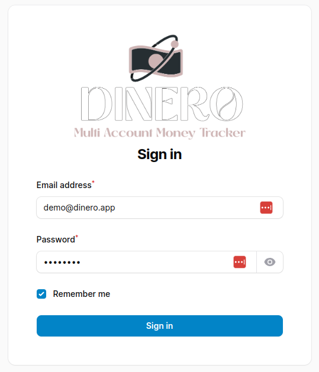

<p align="center">
	<a href="#"  target="_blank" title="Dinero">
		
	</a>
</p>

<br>

<p align="center">:rocket: Multi Account Money Tracker :sparkles: <a href="https://github.com/Shipu/dinero">Dinero</a></p>

<p align="center">
	
    
    
    
    
	<a href="https://opensource.org/licenses/GPL-3.0">
		
	</a>
</p>

## Dinero
Dinero is a multi account money tracker. It is a simple application that allows you to track your money in multiple accounts and categories. It is written in PHP (Laravel Framework) and  Filament v3.

## Features
- Multi Account (Tenants)
- Multi Currency
- Wallets
- Categories
- Budgets
- Goals
- Debts
- Transactions
- Reports

## Installation
1. Clone the repository

```ssh 
git clone https://github.com/Shipu/dinero.git
```

3. Switch to the repo folder

```
cd dinero
```

2. Install all the dependencies using composer

```ssh 
composer install
```

3. Copy the example env file and make the required configuration changes in the .env file

```ssh 
cp .env.example .env
```

4. Generate a new application key

```ssh 
php artisan key:generate
```

5. Run the database migrations with seeder (Set the database connection in .env before migrating)

```ssh 
php artisan migrate --seed
```

6. Run the application

```ssh 
php artisan serve
```

7. Browse the application

> Url: [http://localhost:8000/](http://localhost:8000/)



8. Login with the following credentials:
- Email: `demo@dinero.app`
- Password: `12345678`

## NativePHP
for the NativePHP version, please check the [nativephp branch](https://github.com/shipu/dinero/tree/native-php)
```ssh
git checkout native-php
```

## Demo
> Url: [http://dinero.bridgex.live](http://dinero.bridgex.live)

## Screenshots


### :sparkles: Contributors
<table>
  <tr>
    <td align="center"><a href="https://github.com/Shipu">
        
    <br /><sub><b>Shipu Ahamed</b></sub></a></td>    
    <td align="center"><a href="https://github.com/shojibflamon">
        
    <br /><sub><b>Md. Jahidul Islam</b></sub></a></td>   
    <td align="center"><a href="https://github.com/devalade">
        
    <br /><sub><b>Alade YESSOUFOU</b></sub></a></td>    
    <td align="center"><a href="https://github.com/RafaelBlum">
        
    <br /><sub><b>Rafael Blum</b></sub></a></td> 
  </tr>
</table>

> No one is so wise that they don't have something to learn, nor so foolish that they don't have something to teach. `Blaise Pascal`.
