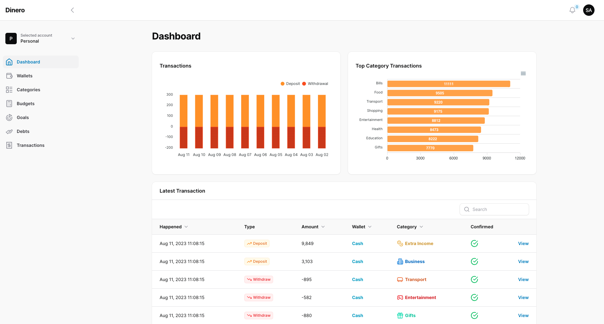
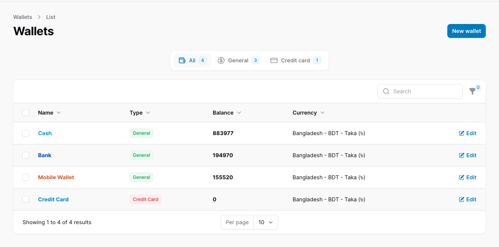
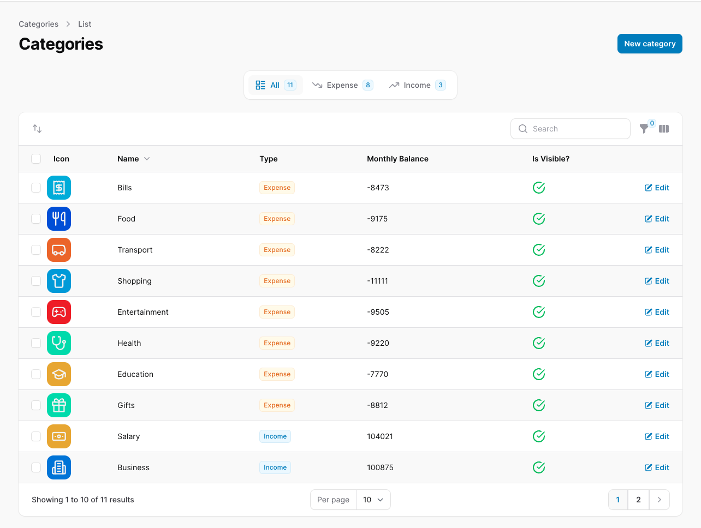
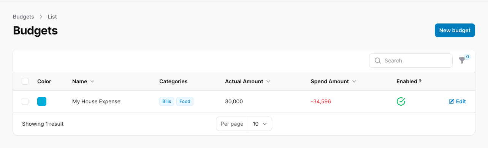
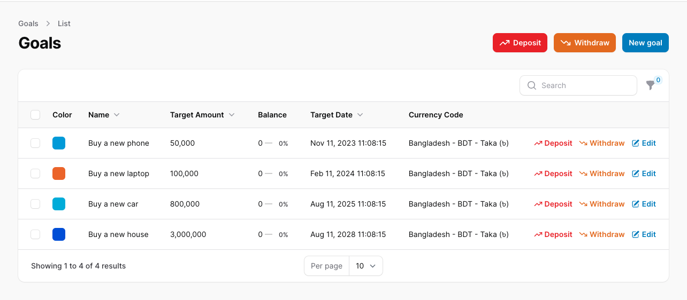
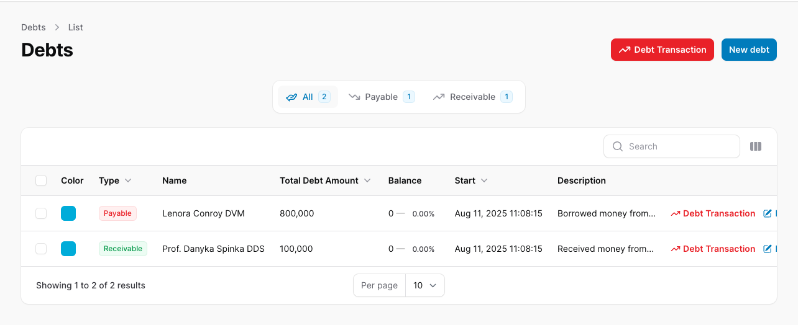
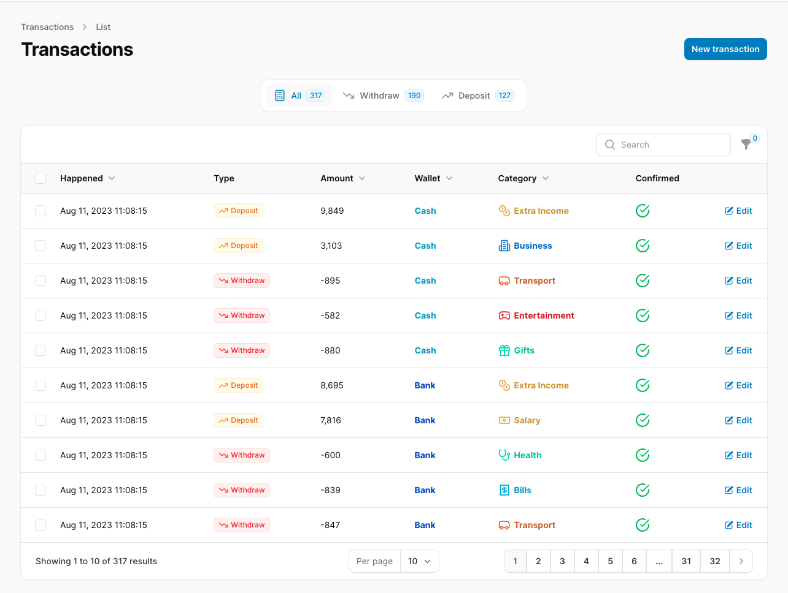
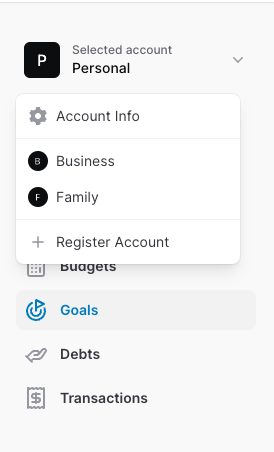
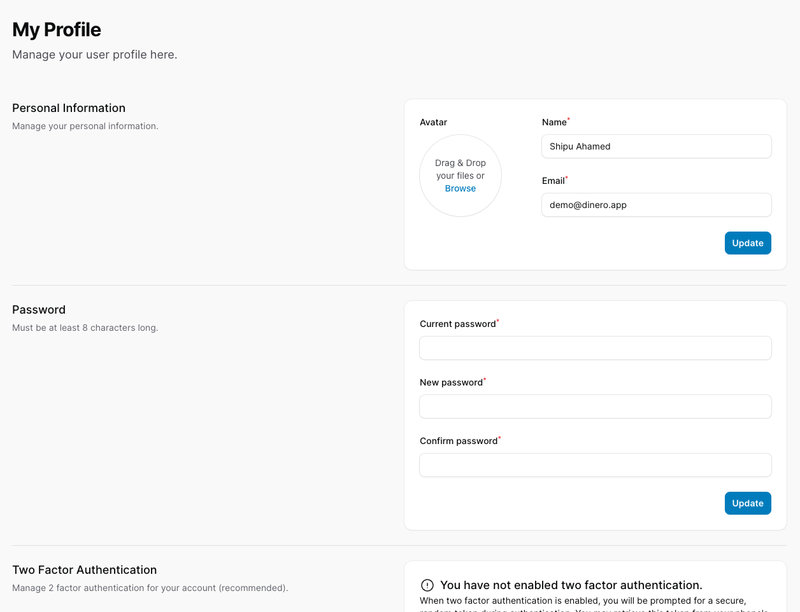

## Dinero - Multi Account Money Tracker
Dinero is a multi account money tracker. It is a simple application that allows you to track your money in multiple accounts and categories. It is written in PHP (Laravel Framework) and  Filament v3.

## Features
- Multi Account (Tenants)
- Multi Currency
- Wallets
- Categories
- Budgets
- Goals
- Debts
- Transactions
- Reports

## Installation
1. Clone the repository
2. Run `composer install`
3. Run `php artisan migrate --seed`
4. Login with the following credentials:
    - Email: `demo@dinero.app`
    - Password: `12345678`

## NativePHP
for the NativePHP version, please check the [nativephp branch](https://github.com/shipu/dinero/tree/native-php)
```ssh
git checkout native-php
```

## Demo
Url: [http://dinero.bridgex.live](https://dinero.app)

## Screenshots









